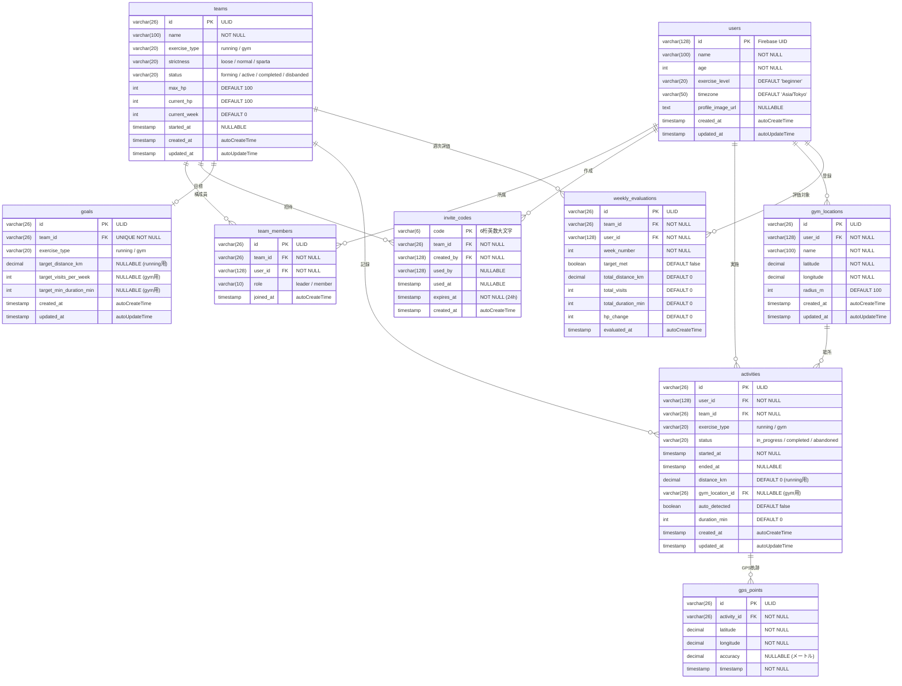

# TRI-KNOT API仕様書

## 目次

1. [共通仕様](#1-共通仕様)
2. [データベーススキーマ](#2-データベーススキーマ)
3. [API エンドポイント一覧](#3-api-エンドポイント一覧)
4. [認証 API](#4-認証-api)
5. [ユーザー API](#5-ユーザー-api)
6. [チーム API](#6-チーム-api)
7. [招待コード API](#7-招待コード-api)
8. [目標設定 API](#8-目標設定-api)
9. [アクティビティ API（ランニング）](#9-アクティビティ-apiランニング)
10. [アクティビティ API（ジム）](#10-アクティビティ-apiジム)
11. [GPS トラッキング API](#11-gps-トラッキング-api)
12. [チーム HP・状態管理 API](#12-チーム-hp状態管理-api)
13. [週次評価 API](#13-週次評価-api)
14. [失敗予測 API](#14-失敗予測-api)

---

## 1. 共通仕様

### ベース URL

```
開発: http://localhost:8080
本番: https://api.tri-knot.example.com
```

### 認証

すべての `/api/*` エンドポイントは Firebase ID トークンによる認証が必要。

```
Authorization: Bearer <Firebase ID Token>
```

### 共通レスポンス形式

#### 成功レスポンス

```json
{
  "data": { ... }
}
```

#### エラーレスポンス

```json
{
  "error": "error_code",
  "message": "人間が読めるエラーメッセージ"
}
```

### 共通 HTTP ステータスコード

| コード | 意味 | 使用場面 |
|--------|------|----------|
| 200 | OK | 取得・更新成功 |
| 201 | Created | リソース作成成功 |
| 400 | Bad Request | リクエスト不正（バリデーションエラー） |
| 401 | Unauthorized | 認証トークンなし or 無効 |
| 403 | Forbidden | 権限なし |
| 404 | Not Found | リソースが存在しない |
| 409 | Conflict | リソース重複（既に存在） |
| 422 | Unprocessable Entity | ビジネスロジックエラー |
| 500 | Internal Server Error | サーバー内部エラー |

### 日時フォーマット

すべての日時は **RFC3339** 形式（`2026-02-10T09:00:00Z`）で返却する。

### ID 体系

| エンティティ | ID 形式 | 例 |
|------------|--------|---|
| User | Firebase UID (string) | `"abc123def456"` |
| Team | ULID (string) | `"01JARQ3K..."` |
| Activity | ULID (string) | `"01JARQ3K..."` |
| Goal | ULID (string) | `"01JARQ3K..."` |
| InviteCode | 6桁英数字 (string) | `"A3K9X2"` |
| GymLocation | ULID (string) | `"01JARQ3K..."` |

---

## 2. データベーススキーマ

### 2.1 users（ユーザー）

既存テーブルを拡張する。

```go
type User struct {
    ID              string    `json:"id" gorm:"primaryKey"`               // Firebase UID
    Name            string    `json:"name" gorm:"not null"`
    Age             int       `json:"age" gorm:"not null"`
    ExerciseLevel   string    `json:"exercise_level" gorm:"default:'beginner'"` // beginner / intermediate / advanced
    Timezone        string    `json:"timezone" gorm:"default:'Asia/Tokyo'"`
    ProfileImageURL string    `json:"profile_image_url"`
    CreatedAt       time.Time `json:"created_at" gorm:"autoCreateTime"`
    UpdatedAt       time.Time `json:"updated_at" gorm:"autoUpdateTime"`
}
```

| カラム | 型 | NULL | デフォルト | 説明 |
|--------|-----|------|-----------|------|
| id | VARCHAR(128) | NO | - | Firebase UID（PK） |
| name | VARCHAR(100) | NO | - | ユーザー名 |
| age | INT | NO | - | 年齢 |
| exercise_level | VARCHAR(20) | NO | `'beginner'` | 運動レベル |
| timezone | VARCHAR(50) | NO | `'Asia/Tokyo'` | タイムゾーン |
| profile_image_url | TEXT | YES | NULL | プロフィール画像URL |
| created_at | TIMESTAMP | NO | now() | 作成日時 |
| updated_at | TIMESTAMP | NO | now() | 更新日時 |

### 2.2 teams（チーム）

```go
type Team struct {
    ID           string    `json:"id" gorm:"primaryKey"`
    Name         string    `json:"name" gorm:"not null"`
    ExerciseType string    `json:"exercise_type" gorm:"not null"`         // running / gym
    Strictness   string    `json:"strictness" gorm:"default:'normal'"`    // loose / normal / sparta
    Status       string    `json:"status" gorm:"default:'forming'"`       // forming / active / completed / disbanded
    MaxHP        int       `json:"max_hp" gorm:"default:100"`
    CurrentHP    int       `json:"current_hp" gorm:"default:100"`
    CurrentWeek  int       `json:"current_week" gorm:"default:0"`
    StartedAt    *time.Time `json:"started_at"`                           // チーム活動開始日（3人揃った時点）
    CreatedAt    time.Time `json:"created_at" gorm:"autoCreateTime"`
    UpdatedAt    time.Time `json:"updated_at" gorm:"autoUpdateTime"`
}
```

| カラム | 型 | NULL | デフォルト | 説明 |
|--------|-----|------|-----------|------|
| id | VARCHAR(26) | NO | - | ULID（PK） |
| name | VARCHAR(100) | NO | - | チーム名 |
| exercise_type | VARCHAR(20) | NO | - | `running` or `gym` |
| strictness | VARCHAR(20) | NO | `'normal'` | 厳格度 |
| status | VARCHAR(20) | NO | `'forming'` | チーム状態 |
| max_hp | INT | NO | 100 | 最大HP |
| current_hp | INT | NO | 100 | 現在HP |
| current_week | INT | NO | 0 | 現在の週数 |
| started_at | TIMESTAMP | YES | NULL | 活動開始日時 |
| created_at | TIMESTAMP | NO | now() | 作成日時 |
| updated_at | TIMESTAMP | NO | now() | 更新日時 |

### 2.3 team_members（チームメンバー）

```go
type TeamMember struct {
    ID       string    `json:"id" gorm:"primaryKey"`
    TeamID   string    `json:"team_id" gorm:"not null;index"`
    UserID   string    `json:"user_id" gorm:"not null;index"`
    Role     string    `json:"role" gorm:"default:'member'"`  // leader / member
    JoinedAt time.Time `json:"joined_at" gorm:"autoCreateTime"`

    Team Team `json:"team,omitempty" gorm:"foreignKey:TeamID"`
    User User `json:"user,omitempty" gorm:"foreignKey:UserID"`
}
```

| カラム | 型 | NULL | デフォルト | 説明 |
|--------|-----|------|-----------|------|
| id | VARCHAR(26) | NO | - | ULID（PK） |
| team_id | VARCHAR(26) | NO | - | チームID（FK → teams.id） |
| user_id | VARCHAR(128) | NO | - | ユーザーID（FK → users.id） |
| role | VARCHAR(10) | NO | `'member'` | `leader` or `member` |
| joined_at | TIMESTAMP | NO | now() | 参加日時 |

**ユニーク制約**: `(team_id, user_id)`

### 2.4 invite_codes（招待コード）

```go
type InviteCode struct {
    Code      string     `json:"code" gorm:"primaryKey;size:6"`
    TeamID    string     `json:"team_id" gorm:"not null;index"`
    CreatedBy string     `json:"created_by" gorm:"not null"`
    UsedBy    *string    `json:"used_by"`
    UsedAt    *time.Time `json:"used_at"`
    ExpiresAt time.Time  `json:"expires_at" gorm:"not null"`
    CreatedAt time.Time  `json:"created_at" gorm:"autoCreateTime"`

    Team Team `json:"team,omitempty" gorm:"foreignKey:TeamID"`
}
```

| カラム | 型 | NULL | デフォルト | 説明 |
|--------|-----|------|-----------|------|
| code | VARCHAR(6) | NO | - | 6桁招待コード（PK） |
| team_id | VARCHAR(26) | NO | - | チームID（FK → teams.id） |
| created_by | VARCHAR(128) | NO | - | 作成者UID |
| used_by | VARCHAR(128) | YES | NULL | 使用者UID |
| used_at | TIMESTAMP | YES | NULL | 使用日時 |
| expires_at | TIMESTAMP | NO | - | 有効期限（作成から24時間） |
| created_at | TIMESTAMP | NO | now() | 作成日時 |

### 2.5 goals（目標設定）

```go
type Goal struct {
    ID                    string    `json:"id" gorm:"primaryKey"`
    TeamID                string    `json:"team_id" gorm:"not null;uniqueIndex"`
    ExerciseType          string    `json:"exercise_type" gorm:"not null"`          // running / gym
    // ランニング用
    TargetDistanceKM      float64   `json:"target_distance_km"`                     // 週あたり目標距離（km）
    // ジム用
    TargetVisitsPerWeek   int       `json:"target_visits_per_week"`                 // 週あたり目標回数
    TargetMinDurationMin  int       `json:"target_min_duration_min"`                // 1回あたり最低滞在時間（分）
    CreatedAt             time.Time `json:"created_at" gorm:"autoCreateTime"`
    UpdatedAt             time.Time `json:"updated_at" gorm:"autoUpdateTime"`

    Team Team `json:"team,omitempty" gorm:"foreignKey:TeamID"`
}
```

| カラム | 型 | NULL | デフォルト | 説明 |
|--------|-----|------|-----------|------|
| id | VARCHAR(26) | NO | - | ULID（PK） |
| team_id | VARCHAR(26) | NO | - | チームID（FK、ユニーク） |
| exercise_type | VARCHAR(20) | NO | - | `running` or `gym` |
| target_distance_km | DECIMAL(5,2) | YES | NULL | 週間目標距離（km） |
| target_visits_per_week | INT | YES | NULL | 週間目標回数 |
| target_min_duration_min | INT | YES | NULL | 1回最低滞在時間（分） |
| created_at | TIMESTAMP | NO | now() | 作成日時 |
| updated_at | TIMESTAMP | NO | now() | 更新日時 |

### 2.6 activities（アクティビティ / 運動記録）

```go
type Activity struct {
    ID            string     `json:"id" gorm:"primaryKey"`
    UserID        string     `json:"user_id" gorm:"not null;index"`
    TeamID        string     `json:"team_id" gorm:"not null;index"`
    ExerciseType  string     `json:"exercise_type" gorm:"not null"`       // running / gym
    Status        string     `json:"status" gorm:"default:'in_progress'"` // in_progress / completed / abandoned
    StartedAt     time.Time  `json:"started_at" gorm:"not null"`
    EndedAt       *time.Time `json:"ended_at"`
    // ランニング用
    DistanceKM    float64    `json:"distance_km" gorm:"default:0"`
    // ジム用
    GymLocationID *string    `json:"gym_location_id"`
    AutoDetected  bool       `json:"auto_detected" gorm:"default:false"`  // ジオフェンスで自動検知したか
    DurationMin   int        `json:"duration_min" gorm:"default:0"`       // 滞在時間（分）
    CreatedAt     time.Time  `json:"created_at" gorm:"autoCreateTime"`
    UpdatedAt     time.Time  `json:"updated_at" gorm:"autoUpdateTime"`

    User        User         `json:"user,omitempty" gorm:"foreignKey:UserID"`
    Team        Team         `json:"team,omitempty" gorm:"foreignKey:TeamID"`
    GymLocation *GymLocation `json:"gym_location,omitempty" gorm:"foreignKey:GymLocationID"`
    GPSPoints   []GPSPoint   `json:"gps_points,omitempty" gorm:"foreignKey:ActivityID"`
}
```

| カラム | 型 | NULL | デフォルト | 説明 |
|--------|-----|------|-----------|------|
| id | VARCHAR(26) | NO | - | ULID（PK） |
| user_id | VARCHAR(128) | NO | - | ユーザーID（FK） |
| team_id | VARCHAR(26) | NO | - | チームID（FK） |
| exercise_type | VARCHAR(20) | NO | - | `running` or `gym` |
| status | VARCHAR(20) | NO | `'in_progress'` | 運動の状態 |
| started_at | TIMESTAMP | NO | - | 開始日時 |
| ended_at | TIMESTAMP | YES | NULL | 終了日時 |
| distance_km | DECIMAL(6,3) | NO | 0 | 移動距離（km） |
| gym_location_id | VARCHAR(26) | YES | NULL | ジムID（FK） |
| auto_detected | BOOLEAN | NO | false | 自動検知フラグ |
| duration_min | INT | NO | 0 | 滞在時間（分） |
| created_at | TIMESTAMP | NO | now() | 作成日時 |
| updated_at | TIMESTAMP | NO | now() | 更新日時 |

### 2.7 gps_points（GPS ポイント）

```go
type GPSPoint struct {
    ID         string    `json:"id" gorm:"primaryKey"`
    ActivityID string    `json:"activity_id" gorm:"not null;index"`
    Latitude   float64   `json:"latitude" gorm:"not null"`
    Longitude  float64   `json:"longitude" gorm:"not null"`
    Accuracy   float64   `json:"accuracy"`                       // メートル単位の精度
    Timestamp  time.Time `json:"timestamp" gorm:"not null;index"`
}
```

| カラム | 型 | NULL | デフォルト | 説明 |
|--------|-----|------|-----------|------|
| id | VARCHAR(26) | NO | - | ULID（PK） |
| activity_id | VARCHAR(26) | NO | - | アクティビティID（FK） |
| latitude | DECIMAL(10,7) | NO | - | 緯度 |
| longitude | DECIMAL(10,7) | NO | - | 経度 |
| accuracy | DECIMAL(6,2) | YES | NULL | GPS精度（m） |
| timestamp | TIMESTAMP | NO | - | 記録時刻 |

### 2.8 gym_locations（ジム位置情報）

```go
type GymLocation struct {
    ID        string    `json:"id" gorm:"primaryKey"`
    UserID    string    `json:"user_id" gorm:"not null;index"`
    Name      string    `json:"name" gorm:"not null"`
    Latitude  float64   `json:"latitude" gorm:"not null"`
    Longitude float64   `json:"longitude" gorm:"not null"`
    RadiusM   int       `json:"radius_m" gorm:"default:100"`     // ジオフェンス半径（メートル）
    CreatedAt time.Time `json:"created_at" gorm:"autoCreateTime"`
    UpdatedAt time.Time `json:"updated_at" gorm:"autoUpdateTime"`

    User User `json:"user,omitempty" gorm:"foreignKey:UserID"`
}
```

| カラム | 型 | NULL | デフォルト | 説明 |
|--------|-----|------|-----------|------|
| id | VARCHAR(26) | NO | - | ULID（PK） |
| user_id | VARCHAR(128) | NO | - | ユーザーID（FK） |
| name | VARCHAR(100) | NO | - | ジム名 |
| latitude | DECIMAL(10,7) | NO | - | 緯度 |
| longitude | DECIMAL(10,7) | NO | - | 経度 |
| radius_m | INT | NO | 100 | ジオフェンス半径（m） |
| created_at | TIMESTAMP | NO | now() | 作成日時 |
| updated_at | TIMESTAMP | NO | now() | 更新日時 |

### 2.9 weekly_evaluations（週次評価）

```go
type WeeklyEvaluation struct {
    ID           string    `json:"id" gorm:"primaryKey"`
    TeamID       string    `json:"team_id" gorm:"not null;index"`
    UserID       string    `json:"user_id" gorm:"not null;index"`
    WeekNumber   int       `json:"week_number" gorm:"not null"`
    TargetMet    bool      `json:"target_met" gorm:"default:false"`
    // ランニング集計
    TotalDistanceKM float64 `json:"total_distance_km" gorm:"default:0"`
    // ジム集計
    TotalVisits     int     `json:"total_visits" gorm:"default:0"`
    TotalDurationMin int    `json:"total_duration_min" gorm:"default:0"`
    // HP変動
    HPChange     int       `json:"hp_change" gorm:"default:0"`     // +（達成）or -（未達成）
    EvaluatedAt  time.Time `json:"evaluated_at" gorm:"autoCreateTime"`

    Team Team `json:"team,omitempty" gorm:"foreignKey:TeamID"`
    User User `json:"user,omitempty" gorm:"foreignKey:UserID"`
}
```

| カラム | 型 | NULL | デフォルト | 説明 |
|--------|-----|------|-----------|------|
| id | VARCHAR(26) | NO | - | ULID（PK） |
| team_id | VARCHAR(26) | NO | - | チームID（FK） |
| user_id | VARCHAR(128) | NO | - | ユーザーID（FK） |
| week_number | INT | NO | - | 週番号 |
| target_met | BOOLEAN | NO | false | 目標達成したか |
| total_distance_km | DECIMAL(6,3) | NO | 0 | 週間走行距離 |
| total_visits | INT | NO | 0 | 週間ジム訪問回数 |
| total_duration_min | INT | NO | 0 | 週間ジム滞在時間合計 |
| hp_change | INT | NO | 0 | HP変動値 |
| evaluated_at | TIMESTAMP | NO | now() | 評価日時 |

**ユニーク制約**: `(team_id, user_id, week_number)`

### ER図



---

## 3. API エンドポイント一覧

### 認証不要

| メソッド | パス | 説明 |
|---------|------|------|
| GET | `/debug/health` | ヘルスチェック |
| GET | `/debug/token?uid=xxx` | デバッグ用トークン生成 |

### 認証必須（`/api/*`）

| メソッド | パス | 説明 |
|---------|------|------|
| **ユーザー** | | |
| GET | `/api/users/me` | 自分の情報取得 |
| POST | `/api/users/me` | ユーザー登録（初回） |
| PUT | `/api/users/me` | ユーザー情報更新 |
| **チーム** | | |
| POST | `/api/teams` | チーム作成 |
| GET | `/api/teams/me` | 自分のチーム取得 |
| GET | `/api/teams/:teamId` | チーム詳細取得 |
| **招待コード** | | |
| POST | `/api/teams/:teamId/invite` | 招待コード生成 |
| POST | `/api/teams/join` | 招待コードでチーム参加 |
| **目標設定** | | |
| POST | `/api/teams/:teamId/goal` | 目標設定 |
| GET | `/api/teams/:teamId/goal` | 目標取得 |
| PUT | `/api/teams/:teamId/goal` | 目標更新 |
| **アクティビティ（ランニング）** | | |
| POST | `/api/activities/running/start` | ランニング開始 |
| POST | `/api/activities/running/:activityId/finish` | ランニング完了 |
| POST | `/api/activities/running/:activityId/gps` | GPS ポイント送信（バッチ） |
| GET | `/api/activities/running/:activityId` | ランニング記録詳細 |
| **アクティビティ（ジム）** | | |
| POST | `/api/gym-locations` | ジム位置登録 |
| GET | `/api/gym-locations` | 登録ジム一覧 |
| DELETE | `/api/gym-locations/:locationId` | ジム位置削除 |
| POST | `/api/activities/gym/checkin` | ジムチェックイン |
| POST | `/api/activities/gym/:activityId/checkout` | ジムチェックアウト |
| GET | `/api/activities/gym/:activityId` | ジム記録詳細 |
| **アクティビティ（共通）** | | |
| GET | `/api/activities` | 自分のアクティビティ一覧 |
| GET | `/api/teams/:teamId/activities` | チーム全体のアクティビティ一覧 |
| **チーム HP・状態** | | |
| GET | `/api/teams/:teamId/status` | チームHP・状態取得 |
| **週次評価** | | |
| GET | `/api/teams/:teamId/evaluations` | 週次評価一覧 |
| GET | `/api/teams/:teamId/evaluations/current` | 今週の進捗状況 |
| **失敗予測** | | |
| GET | `/api/predictions/me` | 自分の失敗予測 |

---

## 4. 認証 API

既存実装を継続使用。変更なし。

### ミドルウェア仕様

- `Authorization: Bearer <token>` ヘッダーから Firebase ID トークンを抽出
- トークン検証後、`c.Set("uid", token.UID)` でコンテキストにセット
- すべての `/api/*` ハンドラで `c.Get("uid").(string)` により認証ユーザーの UID を取得

---

## 5. ユーザー API

### 5.1 GET `/api/users/me` — 自分の情報取得

**リクエスト**: なし（認証トークンから UID 取得）

**レスポンス 200**:

```json
{
  "id": "firebaseUID123",
  "name": "山田太郎",
  "age": 25,
  "exercise_level": "beginner",
  "timezone": "Asia/Tokyo",
  "profile_image_url": "https://example.com/img.jpg",
  "created_at": "2026-02-10T09:00:00Z",
  "updated_at": "2026-02-10T09:00:00Z"
}
```

**エラー**:

| コード | error | message |
|--------|-------|---------|
| 404 | `user_not_found` | ユーザーが見つかりません |

### 5.2 POST `/api/users/me` — ユーザー登録

**リクエストボディ**:

```json
{
  "name": "山田太郎",
  "age": 25,
  "exercise_level": "beginner",
  "timezone": "Asia/Tokyo"
}
```

| フィールド | 型 | 必須 | バリデーション | 説明 |
|-----------|-----|------|--------------|------|
| name | string | YES | 1〜100文字 | ユーザー名 |
| age | int | YES | 13〜120 | 年齢 |
| exercise_level | string | NO | `beginner` / `intermediate` / `advanced` | 運動レベル（デフォルト: `beginner`） |
| timezone | string | NO | IANA タイムゾーン | タイムゾーン（デフォルト: `Asia/Tokyo`） |

**レスポンス 201**:

```json
{
  "id": "firebaseUID123",
  "name": "山田太郎",
  "age": 25,
  "exercise_level": "beginner",
  "timezone": "Asia/Tokyo",
  "profile_image_url": null,
  "created_at": "2026-02-10T09:00:00Z",
  "updated_at": "2026-02-10T09:00:00Z"
}
```

**エラー**:

| コード | error | message |
|--------|-------|---------|
| 400 | `invalid_request` | リクエストの形式が不正です |
| 409 | `user_already_exists` | ユーザーは既に登録されています |

### 5.3 PUT `/api/users/me` — ユーザー情報更新

**リクエストボディ**:

```json
{
  "name": "山田太郎",
  "age": 26,
  "exercise_level": "intermediate",
  "timezone": "Asia/Tokyo",
  "profile_image_url": "https://example.com/new-img.jpg"
}
```

| フィールド | 型 | 必須 | バリデーション | 説明 |
|-----------|-----|------|--------------|------|
| name | string | YES | 1〜100文字 | ユーザー名 |
| age | int | YES | 13〜120 | 年齢 |
| exercise_level | string | NO | `beginner` / `intermediate` / `advanced` | 運動レベル |
| timezone | string | NO | IANA タイムゾーン | タイムゾーン |
| profile_image_url | string | NO | 有効なURL | プロフィール画像URL |

**レスポンス 200**: ユーザーオブジェクト（5.1 と同形式）

**エラー**:

| コード | error | message |
|--------|-------|---------|
| 400 | `invalid_request` | リクエストの形式が不正です |
| 404 | `user_not_found` | ユーザーが見つかりません |

---

## 6. チーム API

### 6.1 POST `/api/teams` — チーム作成

チームを作成し、作成者をリーダーとしてメンバーに追加する。

**リクエストボディ**:

```json
{
  "name": "朝ランチーム",
  "exercise_type": "running",
  "strictness": "normal"
}
```

| フィールド | 型 | 必須 | バリデーション | 説明 |
|-----------|-----|------|--------------|------|
| name | string | YES | 1〜100文字 | チーム名 |
| exercise_type | string | YES | `running` / `gym` | 運動タイプ |
| strictness | string | NO | `loose` / `normal` / `sparta` | 厳格度（デフォルト: `normal`） |

**レスポンス 201**:

```json
{
  "id": "01JARQ3KEXAMPLE00001",
  "name": "朝ランチーム",
  "exercise_type": "running",
  "strictness": "normal",
  "status": "forming",
  "max_hp": 100,
  "current_hp": 100,
  "current_week": 0,
  "started_at": null,
  "members": [
    {
      "user_id": "firebaseUID123",
      "name": "山田太郎",
      "role": "leader",
      "joined_at": "2026-02-10T09:00:00Z"
    }
  ],
  "created_at": "2026-02-10T09:00:00Z",
  "updated_at": "2026-02-10T09:00:00Z"
}
```

**エラー**:

| コード | error | message |
|--------|-------|---------|
| 400 | `invalid_request` | リクエストの形式が不正です |
| 409 | `already_in_team` | 既にアクティブなチームに参加しています |

**ビジネスルール**:
- 1ユーザーが同時に参加できるアクティブチーム（`status = forming` or `active`）は1つのみ

### 6.2 GET `/api/teams/me` — 自分のチーム取得

自分が所属するアクティブなチームを返す。

**リクエスト**: なし

**レスポンス 200**:

```json
{
  "id": "01JARQ3KEXAMPLE00001",
  "name": "朝ランチーム",
  "exercise_type": "running",
  "strictness": "normal",
  "status": "active",
  "max_hp": 100,
  "current_hp": 85,
  "current_week": 3,
  "started_at": "2026-01-20T00:00:00Z",
  "members": [
    {
      "user_id": "firebaseUID123",
      "name": "山田太郎",
      "role": "leader",
      "joined_at": "2026-01-19T09:00:00Z"
    },
    {
      "user_id": "firebaseUID456",
      "name": "佐藤花子",
      "role": "member",
      "joined_at": "2026-01-19T10:00:00Z"
    },
    {
      "user_id": "firebaseUID789",
      "name": "鈴木一郎",
      "role": "member",
      "joined_at": "2026-01-19T11:00:00Z"
    }
  ],
  "goal": {
    "exercise_type": "running",
    "target_distance_km": 15.0,
    "target_visits_per_week": null,
    "target_min_duration_min": null
  },
  "created_at": "2026-01-19T09:00:00Z",
  "updated_at": "2026-02-10T09:00:00Z"
}
```

**エラー**:

| コード | error | message |
|--------|-------|---------|
| 404 | `team_not_found` | アクティブなチームが見つかりません |

### 6.3 GET `/api/teams/:teamId` — チーム詳細取得

**パスパラメータ**:

| パラメータ | 型 | 説明 |
|-----------|-----|------|
| teamId | string | チームID |

**レスポンス 200**: 6.2 と同形式

**エラー**:

| コード | error | message |
|--------|-------|---------|
| 403 | `not_team_member` | このチームのメンバーではありません |
| 404 | `team_not_found` | チームが見つかりません |

---

## 7. 招待コード API

### 7.1 POST `/api/teams/:teamId/invite` — 招待コード生成

**パスパラメータ**:

| パラメータ | 型 | 説明 |
|-----------|-----|------|
| teamId | string | チームID |

**リクエスト**: なし

**レスポンス 201**:

```json
{
  "code": "A3K9X2",
  "team_id": "01JARQ3KEXAMPLE00001",
  "team_name": "朝ランチーム",
  "exercise_type": "running",
  "expires_at": "2026-02-11T09:00:00Z",
  "current_member_count": 1
}
```

**エラー**:

| コード | error | message |
|--------|-------|---------|
| 403 | `not_team_member` | このチームのメンバーではありません |
| 422 | `team_full` | チームは既に3人です |
| 422 | `team_not_forming` | チームは募集中ではありません |

**ビジネスルール**:
- 招待コードは6桁の英数大文字（ランダム生成）
- 有効期限は発行から24時間
- チーム状態が `forming` の時のみ発行可能
- チームメンバーが3人未満の場合のみ発行可能

### 7.2 POST `/api/teams/join` — 招待コードでチーム参加

**リクエストボディ**:

```json
{
  "code": "A3K9X2"
}
```

| フィールド | 型 | 必須 | バリデーション | 説明 |
|-----------|-----|------|--------------|------|
| code | string | YES | 6桁英数大文字 | 招待コード |

**レスポンス 200**:

```json
{
  "team": {
    "id": "01JARQ3KEXAMPLE00001",
    "name": "朝ランチーム",
    "exercise_type": "running",
    "strictness": "normal",
    "status": "forming",
    "members": [
      {
        "user_id": "firebaseUID123",
        "name": "山田太郎",
        "role": "leader",
        "joined_at": "2026-02-10T09:00:00Z"
      },
      {
        "user_id": "firebaseUID456",
        "name": "佐藤花子",
        "role": "member",
        "joined_at": "2026-02-10T10:00:00Z"
      }
    ]
  },
  "team_ready": false
}
```

`team_ready` が `true` の場合（3人揃った場合）:

```json
{
  "team": { ... },
  "team_ready": true
}
```

**エラー**:

| コード | error | message |
|--------|-------|---------|
| 400 | `invalid_request` | リクエストの形式が不正です |
| 404 | `code_not_found` | 招待コードが見つかりません |
| 409 | `already_in_team` | 既にアクティブなチームに参加しています |
| 410 | `code_expired` | 招待コードの有効期限が切れています |
| 410 | `code_used` | 招待コードは既に使用されています |
| 422 | `team_full` | チームは既に3人です |

**ビジネスルール**:
- 参加と同時に招待コードを使用済みにする
- 3人揃った時点でチーム `status` を `forming` のまま維持（目標設定後に `active` に変更）
- 自分のチームには参加できない

---

## 8. 目標設定 API

### 8.1 POST `/api/teams/:teamId/goal` — 目標設定

**パスパラメータ**:

| パラメータ | 型 | 説明 |
|-----------|-----|------|
| teamId | string | チームID |

**リクエストボディ（ランニングの場合）**:

```json
{
  "target_distance_km": 15.0
}
```

**リクエストボディ（ジムの場合）**:

```json
{
  "target_visits_per_week": 3,
  "target_min_duration_min": 60
}
```

| フィールド | 型 | 必須 | バリデーション | 説明 |
|-----------|-----|------|--------------|------|
| target_distance_km | float | ランニング時YES | 1.0〜200.0 | 週間目標距離（km） |
| target_visits_per_week | int | ジム時YES | 1〜7 | 週間目標訪問回数 |
| target_min_duration_min | int | ジム時YES | 15〜480 | 1回最低滞在時間（分） |

**レスポンス 201**:

```json
{
  "id": "01JARQ3KEXAMPLE00002",
  "team_id": "01JARQ3KEXAMPLE00001",
  "exercise_type": "running",
  "target_distance_km": 15.0,
  "target_visits_per_week": null,
  "target_min_duration_min": null,
  "created_at": "2026-02-10T09:00:00Z",
  "updated_at": "2026-02-10T09:00:00Z"
}
```

**エラー**:

| コード | error | message |
|--------|-------|---------|
| 400 | `invalid_request` | リクエストの形式が不正です |
| 403 | `not_team_leader` | チームリーダーのみ目標を設定できます |
| 403 | `not_team_member` | このチームのメンバーではありません |
| 409 | `goal_already_exists` | 目標は既に設定されています |
| 422 | `team_not_ready` | チームメンバーが3人揃っていません |

**ビジネスルール**:
- リーダーのみが設定可能
- チームメンバーが3人揃った状態でのみ設定可能
- 目標設定完了でチーム `status` を `active` に変更し、`started_at` をセット、`current_week` を 1 にする

### 8.2 GET `/api/teams/:teamId/goal` — 目標取得

**レスポンス 200**: 8.1 のレスポンスと同形式

**エラー**:

| コード | error | message |
|--------|-------|---------|
| 403 | `not_team_member` | このチームのメンバーではありません |
| 404 | `goal_not_found` | 目標が設定されていません |

### 8.3 PUT `/api/teams/:teamId/goal` — 目標更新

リクエスト・レスポンスは 8.1 と同形式。

**レスポンス 200**: 更新後の目標オブジェクト

**エラー**:

| コード | error | message |
|--------|-------|---------|
| 403 | `not_team_leader` | チームリーダーのみ目標を更新できます |
| 404 | `goal_not_found` | 目標が設定されていません |

---

## 9. アクティビティ API（ランニング）

### 9.1 POST `/api/activities/running/start` — ランニング開始

**リクエストボディ**:

```json
{
  "latitude": 35.6812362,
  "longitude": 139.7671248
}
```

| フィールド | 型 | 必須 | バリデーション | 説明 |
|-----------|-----|------|--------------|------|
| latitude | float | YES | -90.0〜90.0 | 開始地点の緯度 |
| longitude | float | YES | -180.0〜180.0 | 開始地点の経度 |

**レスポンス 201**:

```json
{
  "id": "01JARQ3KEXAMPLE00003",
  "user_id": "firebaseUID123",
  "team_id": "01JARQ3KEXAMPLE00001",
  "exercise_type": "running",
  "status": "in_progress",
  "started_at": "2026-02-10T07:00:00Z",
  "ended_at": null,
  "distance_km": 0.0,
  "created_at": "2026-02-10T07:00:00Z",
  "updated_at": "2026-02-10T07:00:00Z"
}
```

**エラー**:

| コード | error | message |
|--------|-------|---------|
| 404 | `team_not_found` | アクティブなチームが見つかりません |
| 409 | `activity_in_progress` | 進行中のアクティビティがあります |
| 422 | `team_not_active` | チームがアクティブではありません |
| 422 | `exercise_type_mismatch` | チームの運動タイプがランニングではありません |

**ビジネスルール**:
- 同時に進行中にできるアクティビティは1つのみ
- チームが `active` 状態でのみ開始可能
- チームの `exercise_type` が `running` の場合のみ
- 開始地点をGPSポイントの最初のレコードとして保存

### 9.2 POST `/api/activities/running/:activityId/finish` — ランニング完了

**パスパラメータ**:

| パラメータ | 型 | 説明 |
|-----------|-----|------|
| activityId | string | アクティビティID |

**リクエストボディ**:

```json
{
  "latitude": 35.6815,
  "longitude": 139.7675
}
```

| フィールド | 型 | 必須 | バリデーション | 説明 |
|-----------|-----|------|--------------|------|
| latitude | float | YES | -90.0〜90.0 | 終了地点の緯度 |
| longitude | float | YES | -180.0〜180.0 | 終了地点の経度 |

**レスポンス 200**:

```json
{
  "id": "01JARQ3KEXAMPLE00003",
  "user_id": "firebaseUID123",
  "team_id": "01JARQ3KEXAMPLE00001",
  "exercise_type": "running",
  "status": "completed",
  "started_at": "2026-02-10T07:00:00Z",
  "ended_at": "2026-02-10T07:35:00Z",
  "distance_km": 5.234,
  "duration_min": 35,
  "created_at": "2026-02-10T07:00:00Z",
  "updated_at": "2026-02-10T07:35:00Z"
}
```

**エラー**:

| コード | error | message |
|--------|-------|---------|
| 403 | `not_activity_owner` | このアクティビティの所有者ではありません |
| 404 | `activity_not_found` | アクティビティが見つかりません |
| 422 | `activity_not_in_progress` | アクティビティが進行中ではありません |

**ビジネスルール**:
- 終了地点をGPSポイントの最後のレコードとして保存
- GPSポイントから総移動距離を再計算して `distance_km` を確定
- `status` を `completed` に変更
- `ended_at` をセット
- `duration_min` を `ended_at - started_at` から算出

### 9.3 POST `/api/activities/running/:activityId/gps` — GPSポイント送信（バッチ）

バックグラウンドで蓄積した GPS データをバッチ送信する。

**パスパラメータ**:

| パラメータ | 型 | 説明 |
|-----------|-----|------|
| activityId | string | アクティビティID |

**リクエストボディ**:

```json
{
  "points": [
    {
      "latitude": 35.6812,
      "longitude": 139.7671,
      "accuracy": 5.0,
      "timestamp": "2026-02-10T07:01:00Z"
    },
    {
      "latitude": 35.6815,
      "longitude": 139.7675,
      "accuracy": 8.0,
      "timestamp": "2026-02-10T07:02:00Z"
    }
  ]
}
```

| フィールド | 型 | 必須 | バリデーション | 説明 |
|-----------|-----|------|--------------|------|
| points | array | YES | 1〜1000件 | GPSポイントの配列 |
| points[].latitude | float | YES | -90.0〜90.0 | 緯度 |
| points[].longitude | float | YES | -180.0〜180.0 | 経度 |
| points[].accuracy | float | NO | 0〜1000.0 | 精度（メートル） |
| points[].timestamp | string | YES | RFC3339 | 記録時刻 |

**レスポンス 200**:

```json
{
  "saved_count": 2,
  "current_distance_km": 3.456
}
```

**エラー**:

| コード | error | message |
|--------|-------|---------|
| 400 | `invalid_request` | リクエストの形式が不正です |
| 403 | `not_activity_owner` | このアクティビティの所有者ではありません |
| 404 | `activity_not_found` | アクティビティが見つかりません |
| 422 | `activity_not_in_progress` | アクティビティが進行中ではありません |

**ビジネスルール**:
- GPSポイント保存後、累積距離を再計算して `distance_km` を更新
- 精度が 50m を超えるポイントは距離計算から除外（保存はする）
- タイムスタンプの重複は無視

### 9.4 GET `/api/activities/running/:activityId` — ランニング記録詳細

**レスポンス 200**:

```json
{
  "id": "01JARQ3KEXAMPLE00003",
  "user_id": "firebaseUID123",
  "team_id": "01JARQ3KEXAMPLE00001",
  "exercise_type": "running",
  "status": "completed",
  "started_at": "2026-02-10T07:00:00Z",
  "ended_at": "2026-02-10T07:35:00Z",
  "distance_km": 5.234,
  "duration_min": 35,
  "gps_points": [
    {
      "latitude": 35.6812,
      "longitude": 139.7671,
      "accuracy": 5.0,
      "timestamp": "2026-02-10T07:00:00Z"
    }
  ],
  "created_at": "2026-02-10T07:00:00Z",
  "updated_at": "2026-02-10T07:35:00Z"
}
```

---

## 10. アクティビティ API（ジム）

### 10.1 POST `/api/gym-locations` — ジム位置登録

**リクエストボディ**:

```json
{
  "name": "エニタイムフィットネス 渋谷店",
  "latitude": 35.6580,
  "longitude": 139.7016,
  "radius_m": 100
}
```

| フィールド | 型 | 必須 | バリデーション | 説明 |
|-----------|-----|------|--------------|------|
| name | string | YES | 1〜100文字 | ジム名 |
| latitude | float | YES | -90.0〜90.0 | 緯度 |
| longitude | float | YES | -180.0〜180.0 | 経度 |
| radius_m | int | NO | 50〜500 | ジオフェンス半径（デフォルト: 100m） |

**レスポンス 201**:

```json
{
  "id": "01JARQ3KEXAMPLE00004",
  "user_id": "firebaseUID123",
  "name": "エニタイムフィットネス 渋谷店",
  "latitude": 35.6580,
  "longitude": 139.7016,
  "radius_m": 100,
  "created_at": "2026-02-10T09:00:00Z",
  "updated_at": "2026-02-10T09:00:00Z"
}
```

**エラー**:

| コード | error | message |
|--------|-------|---------|
| 400 | `invalid_request` | リクエストの形式が不正です |

### 10.2 GET `/api/gym-locations` — 登録ジム一覧

**レスポンス 200**:

```json
[
  {
    "id": "01JARQ3KEXAMPLE00004",
    "user_id": "firebaseUID123",
    "name": "エニタイムフィットネス 渋谷店",
    "latitude": 35.6580,
    "longitude": 139.7016,
    "radius_m": 100,
    "created_at": "2026-02-10T09:00:00Z",
    "updated_at": "2026-02-10T09:00:00Z"
  }
]
```

### 10.3 DELETE `/api/gym-locations/:locationId` — ジム位置削除

**レスポンス 204**: No Content

**エラー**:

| コード | error | message |
|--------|-------|---------|
| 403 | `not_location_owner` | このジム位置の所有者ではありません |
| 404 | `location_not_found` | ジム位置が見つかりません |

### 10.4 POST `/api/activities/gym/checkin` — ジムチェックイン

**リクエストボディ**:

```json
{
  "gym_location_id": "01JARQ3KEXAMPLE00004",
  "latitude": 35.6581,
  "longitude": 139.7017,
  "auto_detected": false
}
```

| フィールド | 型 | 必須 | バリデーション | 説明 |
|-----------|-----|------|--------------|------|
| gym_location_id | string | YES | 有効なジムID | ジム位置ID |
| latitude | float | YES | -90.0〜90.0 | 現在位置の緯度 |
| longitude | float | YES | -180.0〜180.0 | 現在位置の経度 |
| auto_detected | bool | NO | - | ジオフェンスによる自動検知か（デフォルト: false） |

**レスポンス 201**:

```json
{
  "id": "01JARQ3KEXAMPLE00005",
  "user_id": "firebaseUID123",
  "team_id": "01JARQ3KEXAMPLE00001",
  "exercise_type": "gym",
  "status": "in_progress",
  "started_at": "2026-02-10T18:00:00Z",
  "ended_at": null,
  "gym_location_id": "01JARQ3KEXAMPLE00004",
  "gym_location_name": "エニタイムフィットネス 渋谷店",
  "auto_detected": false,
  "duration_min": 0,
  "created_at": "2026-02-10T18:00:00Z",
  "updated_at": "2026-02-10T18:00:00Z"
}
```

**エラー**:

| コード | error | message |
|--------|-------|---------|
| 404 | `team_not_found` | アクティブなチームが見つかりません |
| 404 | `location_not_found` | ジム位置が見つかりません |
| 409 | `activity_in_progress` | 進行中のアクティビティがあります |
| 422 | `team_not_active` | チームがアクティブではありません |
| 422 | `exercise_type_mismatch` | チームの運動タイプがジムではありません |
| 422 | `too_far_from_gym` | ジムから離れすぎています（ジオフェンス半径外） |

**ビジネスルール**:
- 送信された現在位置と登録ジムの距離を計算し、`radius_m` 以内であることを検証
- `auto_detected: true` の場合もサーバー側で距離検証を行う

### 10.5 POST `/api/activities/gym/:activityId/checkout` — ジムチェックアウト

**パスパラメータ**:

| パラメータ | 型 | 説明 |
|-----------|-----|------|
| activityId | string | アクティビティID |

**リクエストボディ**:

```json
{
  "latitude": 35.6581,
  "longitude": 139.7017
}
```

| フィールド | 型 | 必須 | バリデーション | 説明 |
|-----------|-----|------|--------------|------|
| latitude | float | YES | -90.0〜90.0 | 現在位置の緯度 |
| longitude | float | YES | -180.0〜180.0 | 現在位置の経度 |

**レスポンス 200**:

```json
{
  "id": "01JARQ3KEXAMPLE00005",
  "user_id": "firebaseUID123",
  "team_id": "01JARQ3KEXAMPLE00001",
  "exercise_type": "gym",
  "status": "completed",
  "started_at": "2026-02-10T18:00:00Z",
  "ended_at": "2026-02-10T19:30:00Z",
  "gym_location_id": "01JARQ3KEXAMPLE00004",
  "gym_location_name": "エニタイムフィットネス 渋谷店",
  "auto_detected": false,
  "duration_min": 90,
  "created_at": "2026-02-10T18:00:00Z",
  "updated_at": "2026-02-10T19:30:00Z"
}
```

**エラー**:

| コード | error | message |
|--------|-------|---------|
| 403 | `not_activity_owner` | このアクティビティの所有者ではありません |
| 404 | `activity_not_found` | アクティビティが見つかりません |
| 422 | `activity_not_in_progress` | アクティビティが進行中ではありません |

**ビジネスルール**:
- `duration_min` を `ended_at - started_at` から算出
- `status` を `completed` に変更

### 10.6 GET `/api/activities/gym/:activityId` — ジム記録詳細

**レスポンス 200**: 10.5 のレスポンスと同形式

---

## 11. GPS トラッキング API

GPS データは 9.3 の `/api/activities/running/:activityId/gps` で送信する。
独立した GPS API は設けず、アクティビティ API に統合する。

### 距離計算ロジック

バックエンドで Haversine 公式を使用して2点間の距離を計算する。

```
a = sin²(Δlat/2) + cos(lat1) × cos(lat2) × sin²(Δlon/2)
c = 2 × atan2(√a, √(1−a))
d = R × c   (R = 6371 km)
```

- GPS ポイントを時刻順にソートし、隣接する2点間の距離を合計
- 精度（accuracy）が 50m を超えるポイントは距離計算から除外
- 連続する2ポイント間の距離が 1km を超える場合は異常値として除外

---

## 12. チーム HP・状態管理 API

### 12.1 GET `/api/teams/:teamId/status` — チームHP・状態取得

**レスポンス 200**:

```json
{
  "team_id": "01JARQ3KEXAMPLE00001",
  "status": "active",
  "current_hp": 85,
  "max_hp": 100,
  "current_week": 3,
  "started_at": "2026-01-20T00:00:00Z",
  "hp_history": [
    { "week": 1, "hp_start": 100, "hp_end": 100, "changes": [
      { "user_id": "firebaseUID123", "user_name": "山田太郎", "hp_change": 0, "target_met": true },
      { "user_id": "firebaseUID456", "user_name": "佐藤花子", "hp_change": 0, "target_met": true },
      { "user_id": "firebaseUID789", "user_name": "鈴木一郎", "hp_change": 0, "target_met": true }
    ]},
    { "week": 2, "hp_start": 100, "hp_end": 85, "changes": [
      { "user_id": "firebaseUID123", "user_name": "山田太郎", "hp_change": 0, "target_met": true },
      { "user_id": "firebaseUID456", "user_name": "佐藤花子", "hp_change": -15, "target_met": false },
      { "user_id": "firebaseUID789", "user_name": "鈴木一郎", "hp_change": 0, "target_met": true }
    ]}
  ],
  "members_progress": [
    {
      "user_id": "firebaseUID123",
      "user_name": "山田太郎",
      "current_week_distance_km": 12.5,
      "current_week_visits": null,
      "current_week_duration_min": null,
      "target_progress_percent": 83.3
    },
    {
      "user_id": "firebaseUID456",
      "user_name": "佐藤花子",
      "current_week_distance_km": 8.0,
      "current_week_visits": null,
      "current_week_duration_min": null,
      "target_progress_percent": 53.3
    },
    {
      "user_id": "firebaseUID789",
      "user_name": "鈴木一郎",
      "current_week_distance_km": 15.2,
      "current_week_visits": null,
      "current_week_duration_min": null,
      "target_progress_percent": 100.0
    }
  ]
}
```

**エラー**:

| コード | error | message |
|--------|-------|---------|
| 403 | `not_team_member` | このチームのメンバーではありません |
| 404 | `team_not_found` | チームが見つかりません |

### HP 計算ルール

| 条件 | HP変動 | 説明 |
|------|--------|------|
| 週目標達成（個人） | 0 | ダメージなし |
| 週目標未達成（個人） | -15 | 厳格度 `normal` の場合 |
| 週目標未達成（個人） | -10 | 厳格度 `loose` の場合 |
| 週目標未達成（個人） | -25 | 厳格度 `sparta` の場合 |
| 全員達成ボーナス | +5 | 全員が目標達成した週 |
| HP が 0 以下 | - | チーム `status` → `disbanded` |

---

## 13. 週次評価 API

### 13.1 GET `/api/teams/:teamId/evaluations` — 週次評価一覧

**クエリパラメータ**:

| パラメータ | 型 | 必須 | 説明 |
|-----------|-----|------|------|
| week | int | NO | 特定の週のみ取得 |

**レスポンス 200**:

```json
[
  {
    "id": "01JARQ3KEXAMPLE00010",
    "team_id": "01JARQ3KEXAMPLE00001",
    "user_id": "firebaseUID123",
    "user_name": "山田太郎",
    "week_number": 1,
    "target_met": true,
    "total_distance_km": 16.5,
    "total_visits": 0,
    "total_duration_min": 0,
    "hp_change": 0,
    "evaluated_at": "2026-01-27T00:00:00Z"
  },
  {
    "id": "01JARQ3KEXAMPLE00011",
    "team_id": "01JARQ3KEXAMPLE00001",
    "user_id": "firebaseUID456",
    "user_name": "佐藤花子",
    "week_number": 1,
    "target_met": true,
    "total_distance_km": 15.2,
    "total_visits": 0,
    "total_duration_min": 0,
    "hp_change": 0,
    "evaluated_at": "2026-01-27T00:00:00Z"
  }
]
```

### 13.2 GET `/api/teams/:teamId/evaluations/current` — 今週の進捗状況

現在の週のリアルタイム進捗を返す（まだ週次評価が確定していない状態）。

**レスポンス 200**:

```json
{
  "team_id": "01JARQ3KEXAMPLE00001",
  "week_number": 3,
  "week_start": "2026-02-03T00:00:00Z",
  "week_end": "2026-02-09T23:59:59Z",
  "days_remaining": 0,
  "members": [
    {
      "user_id": "firebaseUID123",
      "user_name": "山田太郎",
      "total_distance_km": 12.5,
      "total_visits": 0,
      "total_duration_min": 0,
      "target_progress_percent": 83.3,
      "on_track": true,
      "activities_this_week": [
        {
          "id": "01JARQ3KEXAMPLE00003",
          "date": "2026-02-04",
          "distance_km": 5.2,
          "duration_min": 35
        },
        {
          "id": "01JARQ3KEXAMPLE00006",
          "date": "2026-02-06",
          "distance_km": 7.3,
          "duration_min": 48
        }
      ]
    }
  ]
}
```

**`on_track` の判定ロジック**:
- 残り日数を考慮し、現在のペースで週目標に到達可能かを判定
- `(現在の達成量 / 経過日数) × 7 >= 目標値` で判定

---

## 14. 失敗予測 API

### 14.1 GET `/api/predictions/me` — 自分の失敗予測

過去のアクティビティデータから曜日別の成功率を算出し、危険な曜日を警告する。

**レスポンス 200**:

```json
{
  "user_id": "firebaseUID123",
  "analysis_period_weeks": 4,
  "daily_stats": [
    { "day_of_week": 0, "day_name": "日曜日", "success_rate": 0.75, "activity_count": 4, "is_danger": false },
    { "day_of_week": 1, "day_name": "月曜日", "success_rate": 0.25, "activity_count": 4, "is_danger": true },
    { "day_of_week": 2, "day_name": "火曜日", "success_rate": 0.50, "activity_count": 4, "is_danger": false },
    { "day_of_week": 3, "day_name": "水曜日", "success_rate": 0.75, "activity_count": 4, "is_danger": false },
    { "day_of_week": 4, "day_name": "木曜日", "success_rate": 0.50, "activity_count": 4, "is_danger": false },
    { "day_of_week": 5, "day_name": "金曜日", "success_rate": 0.50, "activity_count": 4, "is_danger": false },
    { "day_of_week": 6, "day_name": "土曜日", "success_rate": 1.00, "activity_count": 4, "is_danger": false }
  ],
  "danger_days": ["月曜日"],
  "recommendation": "月曜日が危険です。月曜日は運動をサボりやすい傾向があります。"
}
```

**`is_danger` 判定ロジック**:
- 成功率が 40% 未満の曜日を「危険」と判定
- アクティビティ数が 2 未満の曜日はデータ不足として `is_danger: false`

**エラー**:

| コード | error | message |
|--------|-------|---------|
| 404 | `team_not_found` | アクティブなチームが見つかりません |
| 422 | `insufficient_data` | 予測に必要なデータが不足しています（最低2週間のデータが必要） |

---

## 付録 A: Go 構造体定義まとめ（Request）

```go
package requests

// ユーザー
type CreateUserRequest struct {
    Name          string `json:"name" validate:"required,min=1,max=100"`
    Age           int    `json:"age" validate:"required,min=13,max=120"`
    ExerciseLevel string `json:"exercise_level" validate:"omitempty,oneof=beginner intermediate advanced"`
    Timezone      string `json:"timezone" validate:"omitempty"`
}

type UpdateUserRequest struct {
    Name            string `json:"name" validate:"required,min=1,max=100"`
    Age             int    `json:"age" validate:"required,min=13,max=120"`
    ExerciseLevel   string `json:"exercise_level" validate:"omitempty,oneof=beginner intermediate advanced"`
    Timezone        string `json:"timezone" validate:"omitempty"`
    ProfileImageURL string `json:"profile_image_url" validate:"omitempty,url"`
}

// チーム
type CreateTeamRequest struct {
    Name         string `json:"name" validate:"required,min=1,max=100"`
    ExerciseType string `json:"exercise_type" validate:"required,oneof=running gym"`
    Strictness   string `json:"strictness" validate:"omitempty,oneof=loose normal sparta"`
}

// 招待コード
type JoinTeamRequest struct {
    Code string `json:"code" validate:"required,len=6,alphanum"`
}

// 目標設定
type CreateGoalRequest struct {
    TargetDistanceKM     *float64 `json:"target_distance_km" validate:"omitempty,min=1,max=200"`
    TargetVisitsPerWeek  *int     `json:"target_visits_per_week" validate:"omitempty,min=1,max=7"`
    TargetMinDurationMin *int     `json:"target_min_duration_min" validate:"omitempty,min=15,max=480"`
}

// アクティビティ（ランニング）
type StartRunningRequest struct {
    Latitude  float64 `json:"latitude" validate:"required,min=-90,max=90"`
    Longitude float64 `json:"longitude" validate:"required,min=-180,max=180"`
}

type FinishRunningRequest struct {
    Latitude  float64 `json:"latitude" validate:"required,min=-90,max=90"`
    Longitude float64 `json:"longitude" validate:"required,min=-180,max=180"`
}

type GPSPointRequest struct {
    Latitude  float64 `json:"latitude" validate:"required,min=-90,max=90"`
    Longitude float64 `json:"longitude" validate:"required,min=-180,max=180"`
    Accuracy  float64 `json:"accuracy" validate:"omitempty,min=0,max=1000"`
    Timestamp string  `json:"timestamp" validate:"required"`
}

type SendGPSPointsRequest struct {
    Points []GPSPointRequest `json:"points" validate:"required,min=1,max=1000,dive"`
}

// アクティビティ（ジム）
type CreateGymLocationRequest struct {
    Name      string  `json:"name" validate:"required,min=1,max=100"`
    Latitude  float64 `json:"latitude" validate:"required,min=-90,max=90"`
    Longitude float64 `json:"longitude" validate:"required,min=-180,max=180"`
    RadiusM   int     `json:"radius_m" validate:"omitempty,min=50,max=500"`
}

type GymCheckinRequest struct {
    GymLocationID string  `json:"gym_location_id" validate:"required"`
    Latitude      float64 `json:"latitude" validate:"required,min=-90,max=90"`
    Longitude     float64 `json:"longitude" validate:"required,min=-180,max=180"`
    AutoDetected  bool    `json:"auto_detected"`
}

type GymCheckoutRequest struct {
    Latitude  float64 `json:"latitude" validate:"required,min=-90,max=90"`
    Longitude float64 `json:"longitude" validate:"required,min=-180,max=180"`
}
```

## 付録 B: Go 構造体定義まとめ（Response）

```go
package response

// 共通エラー
type ErrorResponse struct {
    Error   string `json:"error"`
    Message string `json:"message"`
}

// ユーザー
type UserResponse struct {
    ID              string  `json:"id"`
    Name            string  `json:"name"`
    Age             int     `json:"age"`
    ExerciseLevel   string  `json:"exercise_level"`
    Timezone        string  `json:"timezone"`
    ProfileImageURL *string `json:"profile_image_url"`
    CreatedAt       string  `json:"created_at"`
    UpdatedAt       string  `json:"updated_at"`
}

// チーム
type TeamMemberResponse struct {
    UserID   string `json:"user_id"`
    Name     string `json:"name"`
    Role     string `json:"role"`
    JoinedAt string `json:"joined_at"`
}

type GoalResponse struct {
    ID                   string   `json:"id"`
    TeamID               string   `json:"team_id"`
    ExerciseType         string   `json:"exercise_type"`
    TargetDistanceKM     *float64 `json:"target_distance_km"`
    TargetVisitsPerWeek  *int     `json:"target_visits_per_week"`
    TargetMinDurationMin *int     `json:"target_min_duration_min"`
    CreatedAt            string   `json:"created_at"`
    UpdatedAt            string   `json:"updated_at"`
}

type TeamResponse struct {
    ID           string               `json:"id"`
    Name         string               `json:"name"`
    ExerciseType string               `json:"exercise_type"`
    Strictness   string               `json:"strictness"`
    Status       string               `json:"status"`
    MaxHP        int                  `json:"max_hp"`
    CurrentHP    int                  `json:"current_hp"`
    CurrentWeek  int                  `json:"current_week"`
    StartedAt    *string              `json:"started_at"`
    Members      []TeamMemberResponse `json:"members"`
    Goal         *GoalResponse        `json:"goal,omitempty"`
    CreatedAt    string               `json:"created_at"`
    UpdatedAt    string               `json:"updated_at"`
}

// 招待コード
type InviteCodeResponse struct {
    Code               string `json:"code"`
    TeamID             string `json:"team_id"`
    TeamName           string `json:"team_name"`
    ExerciseType       string `json:"exercise_type"`
    ExpiresAt          string `json:"expires_at"`
    CurrentMemberCount int    `json:"current_member_count"`
}

type JoinTeamResponse struct {
    Team      TeamResponse `json:"team"`
    TeamReady bool         `json:"team_ready"`
}

// アクティビティ
type ActivityResponse struct {
    ID              string             `json:"id"`
    UserID          string             `json:"user_id"`
    TeamID          string             `json:"team_id"`
    ExerciseType    string             `json:"exercise_type"`
    Status          string             `json:"status"`
    StartedAt       string             `json:"started_at"`
    EndedAt         *string            `json:"ended_at"`
    DistanceKM      float64            `json:"distance_km,omitempty"`
    GymLocationID   *string            `json:"gym_location_id,omitempty"`
    GymLocationName *string            `json:"gym_location_name,omitempty"`
    AutoDetected    bool               `json:"auto_detected,omitempty"`
    DurationMin     int                `json:"duration_min"`
    GPSPoints       []GPSPointResponse `json:"gps_points,omitempty"`
    CreatedAt       string             `json:"created_at"`
    UpdatedAt       string             `json:"updated_at"`
}

type GPSPointResponse struct {
    Latitude  float64 `json:"latitude"`
    Longitude float64 `json:"longitude"`
    Accuracy  float64 `json:"accuracy"`
    Timestamp string  `json:"timestamp"`
}

type SendGPSPointsResponse struct {
    SavedCount       int     `json:"saved_count"`
    CurrentDistanceKM float64 `json:"current_distance_km"`
}

// ジム位置
type GymLocationResponse struct {
    ID        string  `json:"id"`
    UserID    string  `json:"user_id"`
    Name      string  `json:"name"`
    Latitude  float64 `json:"latitude"`
    Longitude float64 `json:"longitude"`
    RadiusM   int     `json:"radius_m"`
    CreatedAt string  `json:"created_at"`
    UpdatedAt string  `json:"updated_at"`
}

// チーム HP・状態
type HPChangeEntry struct {
    UserID    string `json:"user_id"`
    UserName  string `json:"user_name"`
    HPChange  int    `json:"hp_change"`
    TargetMet bool   `json:"target_met"`
}

type WeekHPHistory struct {
    Week    int             `json:"week"`
    HPStart int             `json:"hp_start"`
    HPEnd   int             `json:"hp_end"`
    Changes []HPChangeEntry `json:"changes"`
}

type MemberProgress struct {
    UserID                 string   `json:"user_id"`
    UserName               string   `json:"user_name"`
    CurrentWeekDistanceKM  *float64 `json:"current_week_distance_km"`
    CurrentWeekVisits      *int     `json:"current_week_visits"`
    CurrentWeekDurationMin *int     `json:"current_week_duration_min"`
    TargetProgressPercent  float64  `json:"target_progress_percent"`
}

type TeamStatusResponse struct {
    TeamID          string           `json:"team_id"`
    Status          string           `json:"status"`
    CurrentHP       int              `json:"current_hp"`
    MaxHP           int              `json:"max_hp"`
    CurrentWeek     int              `json:"current_week"`
    StartedAt       string           `json:"started_at"`
    HPHistory       []WeekHPHistory  `json:"hp_history"`
    MembersProgress []MemberProgress `json:"members_progress"`
}

// 週次評価
type WeeklyEvaluationResponse struct {
    ID               string  `json:"id"`
    TeamID           string  `json:"team_id"`
    UserID           string  `json:"user_id"`
    UserName         string  `json:"user_name"`
    WeekNumber       int     `json:"week_number"`
    TargetMet        bool    `json:"target_met"`
    TotalDistanceKM  float64 `json:"total_distance_km"`
    TotalVisits      int     `json:"total_visits"`
    TotalDurationMin int     `json:"total_duration_min"`
    HPChange         int     `json:"hp_change"`
    EvaluatedAt      string  `json:"evaluated_at"`
}

type WeekActivitySummary struct {
    ID          string  `json:"id"`
    Date        string  `json:"date"`
    DistanceKM  float64 `json:"distance_km,omitempty"`
    DurationMin int     `json:"duration_min"`
}

type CurrentWeekMemberProgress struct {
    UserID                string                `json:"user_id"`
    UserName              string                `json:"user_name"`
    TotalDistanceKM       float64               `json:"total_distance_km"`
    TotalVisits           int                   `json:"total_visits"`
    TotalDurationMin      int                   `json:"total_duration_min"`
    TargetProgressPercent float64               `json:"target_progress_percent"`
    OnTrack               bool                  `json:"on_track"`
    ActivitiesThisWeek    []WeekActivitySummary `json:"activities_this_week"`
}

type CurrentWeekEvaluationResponse struct {
    TeamID        string                      `json:"team_id"`
    WeekNumber    int                         `json:"week_number"`
    WeekStart     string                      `json:"week_start"`
    WeekEnd       string                      `json:"week_end"`
    DaysRemaining int                         `json:"days_remaining"`
    Members       []CurrentWeekMemberProgress `json:"members"`
}

// 失敗予測
type DailyStat struct {
    DayOfWeek    int     `json:"day_of_week"`
    DayName      string  `json:"day_name"`
    SuccessRate  float64 `json:"success_rate"`
    ActivityCount int    `json:"activity_count"`
    IsDanger     bool    `json:"is_danger"`
}

type PredictionResponse struct {
    UserID              string      `json:"user_id"`
    AnalysisPeriodWeeks int         `json:"analysis_period_weeks"`
    DailyStats          []DailyStat `json:"daily_stats"`
    DangerDays          []string    `json:"danger_days"`
    Recommendation      string      `json:"recommendation"`
}
```

## 付録 C: 状態遷移図

### チーム状態

```
forming ──(3人揃い＋目標設定)──> active ──(HP=0)──> disbanded
                                      │
                                      └──(任意解散)──> disbanded
```

### アクティビティ状態

```
            ┌──(開始)──> in_progress ──(完了)──> completed
            │                │
            │                └──(放棄/タイムアウト)──> abandoned
```

### 週次評価フロー

```
毎週月曜 00:00 (JST) に自動評価実行:
1. 前週の各メンバーのアクティビティを集計
2. 目標達成判定
3. HP計算・更新
4. weekly_evaluations レコード作成
5. HP <= 0 の場合チーム disbanded
```