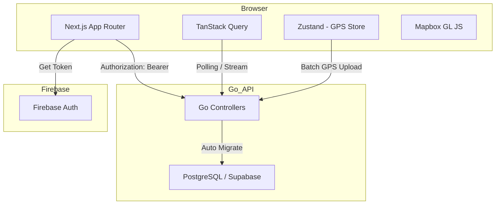

1. 技術スタック選定
Framework: Next.js (App Router)

Language: TypeScript

State Management:

Server State: TanStack Query (React Query) — APIとの同期、キャッシュ管理。

Client State: Zustand — 進行中のアクティビティ（ランニング中か等）のグローバル管理。

Styling: Tailwind CSS + Shadcn/ui — 迅速なUI構築。

Maps/GPS: Mapbox GL JS (or React Map GL) — ランニング軌跡の可視化。

Realtime: Supabase Realtime (API仕様書にあるWebSocket/Realtime要件を補完)

Data Fetching: OpenAPI TypeScript — GoのSwagger(swagger.json)から型を自動生成し、APIクライアントを型安全にする。

2. ディレクトリ構造（App Router最適化）
```
src/
├── app/                  # App Router（Page, Layout, Loading）
│   ├── (auth)/           # ログイン・会員登録
│   ├── (main)/           # 認証後画面（ダッシュボード、チーム、設定）
│   │   ├── team/         # チーム状態・縄のビジュアル
│   │   └── activity/     # ランニング/ジム計測画面
│   └── api/              # Route Handlers (Firebase Admin等が必要な場合)
├── components/
│   ├── activity/         # GPS計測、マップ、タイマー
│   ├── team/             # 縄のアニメーション、HPゲージ、メンバー進捗
│   └── ui/               # 汎用コンポーネント (shadcn)
├── hooks/                # useGpsTracking, useAuth, useTeamStatus
├── lib/
│   ├── api/              # 生成されたAPIクライアント (fetch wrapper)
│   ├── firebase/         # Firebase Client SDK設定
│   └── utils/            # 距離計算、日時フォーマット(date-fns)
├── store/                # Zustand (activeActivityStore等)
└── types/                # APIレスポンス等の型定義
```
3. フロントエンドの重要アーキテクチャ戦略
① APIクライアントの型安全 (Source of Truth)
Go側の docs/swagger.json を利用して、フロントエンドの型を自動生成します。
これにより、UserResponse や TeamStatusResponse のフィールド変更が即座にフロントエンドに波及し、コンパイルエラーで検知できます。

② ハイブリッドGPSトラッキング (Heartbeat)
ランニングモードの仕様（開始 → GPS送信 → 完了）に対応するため、以下の設計にします。

ブラウザの Geolocation API を watchPosition で使用。

Zustand でメモリ上に GPSPoints を蓄積。

一定間隔（例：30秒ごと）または一定距離ごとに POST /api/activities/running/:id/gps へバッチ送信。 これにより、通信断絶時もブラウザ上でデータを保持し、再開時に同期できます。

③ 縄のビジュアル・状態管理 (UI logic)
GET /api/teams/:id/status から得られる current_hp に基づき、縄の状態を出し分けます。

状態分岐: HP 100-70, 69-40, 39-10, 0 の4段階をCSSアニメーションまたはSVGフィルタで表現します。

リアルタイム通知: 他のメンバーの完了通知は、Supabase Realtime等のイベントをフックに TanStack Query のキャッシュを invalidate（再取得）させることで、最新の members_progress を反映します。

④ 認証ミドルウェア (Firebase Integration)
middleware.ts を活用し、Firebaseのセッションがあるかを確認します。
APIへのリクエスト時は、Firebase Client SDKから取得した idToken を Authorization: Bearer <token> として付与する Fetch Wrapper を作成します。

4. ハッカソン向けの実装優先順位
Firebase認証 & ユーザー登録: POST /api/users/me の疎通。

チーム結成フロー: 招待コード によるマッチング。

アクティビティ計測: ランニングのGPS蓄積と finish 処理。

ダッシュボード: 自分のチームのHPとメンバーの進捗可視化。

縄のビジュアル: HPに応じた縄の見た目変化（コンセプトの象徴）。

5. アーキテクチャ図のイメージ
